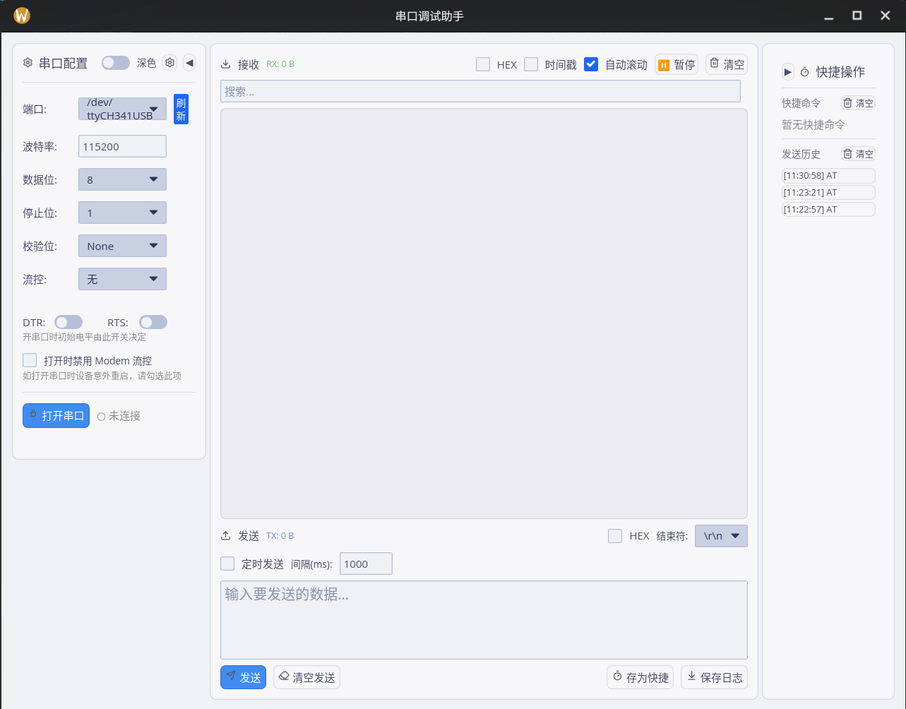

# 串口调试助手 (SerialTool-Rust)

> 基于 **Rust + [iced](https://github.com/iced-rs/iced) 0.14** 构建的跨平台串口调试工具，支持 Windows / Linux / macOS

---

## 程序界面预览



---

## 功能特性

| 分类 | 功能 |
|------|------|
| 串口配置 | 端口选择、波特率（预设 + 自定义输入）、数据位、停止位、校验位、流量控制 |
| 信号控制 | DTR / RTS 手动实时切换 |
| 防复位 | 打开串口时防止 USB 转串口芯片拉高 DTR 导致目标设备复位（CH340 等） |
| 数据收发 | ASCII / HEX 双模式独立切换，接收显示与发送互不干扰 |
| 接收区 | 时间戳（三种格式）、自动滚动、暂停接收、关键字过滤、字号 Ctrl+滚轮缩放 |
| 发送区 | 行结束符选择（\\r\\n / \\n / \\r / 无）、定时自动发送（最小 100 ms）、历史记录 Up/Down 键导航 |
| 快捷命令 | 20 个命名槽位，支持 HEX 模式，持久化到本地 JSON |
| 发送历史 | 最近 50 条记录，点击一键复用 |
| 日志 | 一键保存为带时间戳文本文件，日志目录可自定义 |
| 主题 | TokyoNight（深色）/ CatppuccinLatte（浅色）一键切换 |
| 布局 | 三列面板可拖拽调宽，宽度持久化；左/右面板支持折叠 |
| 设置持久化 | 上次端口/波特率、面板宽度、字号、发送模式等重启后自动恢复 |

---

## 快速开始

```bash
# 克隆仓库
git clone https://github.com/boast7z/SerialTool-rust.git
cd SerialTool-rust

# 开发运行（debug 构建，保留控制台，方便查看日志）
cargo run --bin serial-debugger

# Release 构建
cargo build --release --bin serial-debugger
```

### Linux 串口权限

```bash
# 将当前用户加入 dialout 组，无需每次 sudo
sudo usermod -aG dialout $USER
# 重新登录后生效
```

配置文件（快捷命令 + 应用设置）保存在：

| 平台 | 路径 |
|------|------|
| Windows | `%APPDATA%\iced_serialtool\` |
| Linux / macOS | `~/.config/iced_serialtool/` |

---

## 功能演示

### 1. 串口连接

1. 在左侧面板选择端口（列表每 2 秒自动刷新）
2. 选择或手动输入波特率（默认 115200）
3. 按需调整数据位 / 停止位 / 校验位 / 流控
4. 点击 **打开** 按钮建立连接，状态栏显示 `[已连接]`

> **提示（Linux）**：首次出现权限错误时，点击出现的「提权」按钮，程序会通过 `pkexec` 自动写入 udev 规则并重载，无需手动 `sudo`。

### 2. 数据接收

- **ASCII 模式**：可见字符原样显示，控制字符替换为 `.`，CRLF 自动规范化为 LF
- **HEX 模式**：每字节显示为两位大写十六进制（如 `41 0D 0A`）
- **关键字过滤**：在接收区工具栏输入关键字，只显示含该关键字的行
- **字号缩放**：按住 `Ctrl` 滚动鼠标滚轮调整字号（8–28 px），点击当前字号数字重置为 13 px
- **暂停 / 恢复**：点击「暂停」冻结显示（数据仍累计计数），再次点击恢复

### 3. 数据发送

- **Enter 发送模式**（默认）：`Enter` 立即发送，`Ctrl+Enter` 插入换行
- **Enter 换行模式**：`Enter` 插入换行，`Ctrl+Enter` 发送
- 在应用设置页（左上角齿轮图标）切换发送模式
- **HEX 发送**：输入内容为空格分隔或紧凑的十六进制字节，如 `41 42 0D 0A` 或 `41420D0A`
- **行结束符**：ASCII 模式下在行尾自动追加所选结束符（HEX 模式忽略此设置）

### 4. 定时发送

1. 在发送区输入待发送内容
2. 勾选「定时发送」并填写间隔（毫秒，最小 100）
3. 打开串口后自动按间隔重复发送

### 5. 快捷命令

- 右侧面板最多可配置 20 条命名快捷命令
- 点击铅笔图标进入内联编辑，支持设置名称、内容、HEX 模式
- 点击命令按钮立即发送（使用当前行结束符设置）
- 在发送框中点击「存为快捷命令」可快速将当前内容保存到第一个空槽位

### 6. 发送历史

- 每次成功发送自动记录，最多保留 50 条
- 在发送框（单行内容时）按 `↑` / `↓` 键翻阅历史记录
- 点击历史列表中的条目将其内容复制到发送框

### 7. 日志保存

点击「保存日志」按钮，接收区所有内容保存为 `serial_log_YYYYMMDD_HHMMSS.txt`。

在应用设置页可自定义日志保存目录（默认为系统文档目录）。

### 8. 防 USB 串口复位（CH340 / CH341）

某些 USB 转串口芯片在 `open()` 时会短暂拉高 DTR，导致目标设备被复位。

- **Windows**：勾选「防复位」后写注册表 `DisableModemOutHandShake`，首次生效需重新插拔 USB
- **Linux**：自动使用 pre_open 守护 fd 方案，在驱动 open_count > 0 时跳过 DTR 初始化；对于无 `no_dtr_on_open` 参数的旧版 ch341 内核模块，点击「修复 CH341 驱动」自动编译安装打过补丁的驱动

---

## 架构说明

### 整体结构

```
main.rs
  └─ iced::application(AppState::new, ui::update, ui::view)
       ├─ theme      → ui::theme::get_theme(&state.monitor)
       ├─ subscription → ui::subscription()
       └─ window     → icon 从 icons/128x128.png 编译时嵌入
```

### 状态分层

```
AppState
 ├─ monitor: SerialMonitor        ← UI 层状态（只有 view/update 读写）
 │    ├─ port: PortConfig         ← 串口参数 + 端口列表
 │    ├─ terminal: TerminalState  ← 接收区 / 发送区 / 计数器
 │    └─ layout: LayoutState      ← 三列布局宽度 + 拖拽状态
 ├─ history: History              ← 发送历史（最近 50 条）
 ├─ quick_commands: QuickCommands ← 快捷命令（20 槽，持久化）
 ├─ app_settings: AppSettings     ← 应用设置（持久化到 settings.json）
 └─ port_handle: Option<PortHandle>  ← Arc<Mutex<Box<dyn SerialPort>>>
```

### 模块职责

| 模块 | 文件 | 职责 |
|------|------|------|
| 入口 | `src/main.rs` | iced 应用构建，窗口图标嵌入 |
| 类型定义 | `src/types.rs` | 所有枚举、结构体、`Message` 的单一来源 |
| 应用状态机 | `src/ui/mod.rs` | `AppState`、`update()`、`view()`、`subscription()` |
| 串口配置面板 | `src/ui/settings.rs` | 左列视图：端口选择、参数配置、应用设置页 |
| 终端面板 | `src/ui/terminal.rs` | 中列视图：接收区 + 发送区 |
| 侧边栏 | `src/ui/sidebar.rs` | 右列视图：快捷命令 + 发送历史 |
| 分隔条 | `src/ui/splitter.rs` | 可拖拽面板分隔条组件 + 鼠标事件订阅 |
| 主题 | `src/ui/theme.rs` | TokyoNight / CatppuccinLatte 调色板 |
| 样式 | `src/ui/styles.rs` | iced 控件样式函数 |
| 图标 | `src/ui/icons.rs` | SVG 图标常量 |
| 串口 I/O | `src/backend/mod.rs` | `open_port()` / `send_data()` / `read_data()` / 数据格式转换 |
| 防复位 | `src/backend/no_reset.rs` | Windows 注册表方案 + Linux pre/post_open 方案 |
| 应用设置 | `src/backend/app_settings.rs` | 设置序列化 / 反序列化 / 路径管理 |
| 发送历史 | `src/backend/history.rs` | 最近 50 条记录的内存维护 |
| 快捷命令 | `src/backend/quick_commands.rs` | 20 槽快捷命令持久化到 JSON |
| 提权 | `src/backend/privileges.rs` | Windows UAC / Linux pkexec udev 规则 |
| CH341 修复 | `src/backend/ch341_fix.rs` | Linux：编译安装带 no_dtr_on_open 补丁的 ch341 内核模块 |

### 函数与类型参考

完整的函数签名、参数说明和内部行为描述，请查阅独立文档：

**[docs/API.md](docs/API.md)**

涵盖内容：所有公开枚举和结构体（含字段说明）、后端 I/O 函数、防复位方案实现、设置持久化、历史/快捷命令管理、提权流程、UI 渲染函数、订阅和状态机入口。

---

## 打包发布

详见 [docs/PACKAGING.md](docs/PACKAGING.md)，支持以下格式：

| 格式 | 平台 | 命令 |
|------|------|------|
| NSIS `.exe` 安装程序 | Windows | `cargo packager --release --formats nsis` |
| `.deb` | Debian / Ubuntu | `cargo packager --release --formats deb` |
| AppImage | Linux 通用 | `cargo packager --release --formats appimage` |
| `.tar.zst` (pacman) | Arch Linux | `cargo packager --release --formats pacman` |
| `.rpm` | Fedora / RHEL / openSUSE | `cargo build --release && cargo generate-rpm` |

---

## 依赖

| crate | 用途 |
|-------|------|
| [iced](https://crates.io/crates/iced) 0.14 | GUI 框架（Elm 架构，GPU 渲染） |
| [serialport](https://crates.io/crates/serialport) 4 | 跨平台串口 I/O |
| [tokio](https://crates.io/crates/tokio) | 异步运行时（用于订阅和阻塞任务 spawn） |
| [serde](https://crates.io/crates/serde) + serde_json | 设置 / 快捷命令持久化 |
| [chrono](https://crates.io/crates/chrono) | 时间戳格式化 / 日志文件命名 |
| [dirs](https://crates.io/crates/dirs) | 跨平台配置目录 / 文档目录定位 |
| winreg（Windows only） | 注册表读写（防复位方案） |
| libc（非 Windows） | pre_open 守护 fd（防复位方案） |
| tempfile（Linux） | CH341 驱动安装临时目录 |

---

## 未完成功能规划

### 近期（v0.5.x）

- [ ] **多标签页 / 多串口**：同时打开多个串口，每个串口独占一个标签页
- [ ] **绘图面板**：解析固定格式数值数据（如 `V:3.30,I:0.12`），实时绘制折线图
- [ ] **协议解析插件**：预置 Modbus RTU / ASCII 帧解析，高亮显示帧头、地址、功能码、CRC
- [ ] **宏录制与回放**：录制一段收发交互序列，按时序自动回放
- [ ] **接收区高亮规则**：用户可配置正则表达式，匹配行按颜色高亮

### 中期（v0.6.x）

- [ ] **脚本发送**：内嵌简单脚本引擎（Lua 或 Rhai），支持条件判断、循环、延时发送
- [ ] **数据统计面板**：波特率利用率、帧率、错误率实时统计
- [ ] **会话文件**：将串口配置、快捷命令、日志目录打包为 `.session` 文件，一键切换项目
- [ ] **主题编辑器**：在应用内自定义颜色方案并导出为 JSON

### 长期

- [ ] **移动端（Android）**：通过 USB OTG 连接串口设备，复用同一套 Rust 逻辑
- [ ] **远程串口**：通过 TCP/WebSocket 将本机串口转发到远端，支持多人共享调试

---

## 更新日志

### v0.4.0

- 接收区字号可调：`Ctrl+滚轮`缩放（8–28 px），点击字号数字重置为 13 px
- 发送框历史导航：单行内容时按 `↑`/`↓` 键翻历史
- 上次端口与波特率记忆：连接成功后自动保存，重启恢复
- 面板宽度持久化：拖拽后自动保存
- 应用设置独立页面：左上角齿轮图标进入

### v0.3.0

- 日志保存目录可配置（默认文档文件夹）
- `SerialMonitor` 拆分为 `PortConfig` / `TerminalState` / `LayoutState` 三个子结构体

### v0.2.0

- 接收区改为按行存储（最多 2000 行），高速数据流不再掉帧
- 端口列表每 2 秒自动检测变化
- 接收区新增关键字过滤

### v0.1.1（Bug 修复）

- 修复接收缓冲区截断时 UTF-8 字节边界导致崩溃
- 修复 HEX 模式输入中文时崩溃
- 修复串口异常断开后 RX/TX 计数不归零
- 修复拖拽分隔条在屏幕 x=0 时哨兵值判断错误

### v0.1.0（初始版本）

- 串口调试助手完整功能：参数配置、数据收发、快捷命令、发送历史、日志保存
- Windows NSIS 安装程序打包
- Linux deb / AppImage / pacman / rpm 打包支持
- 深色 / 浅色主题

---

## License

MIT
